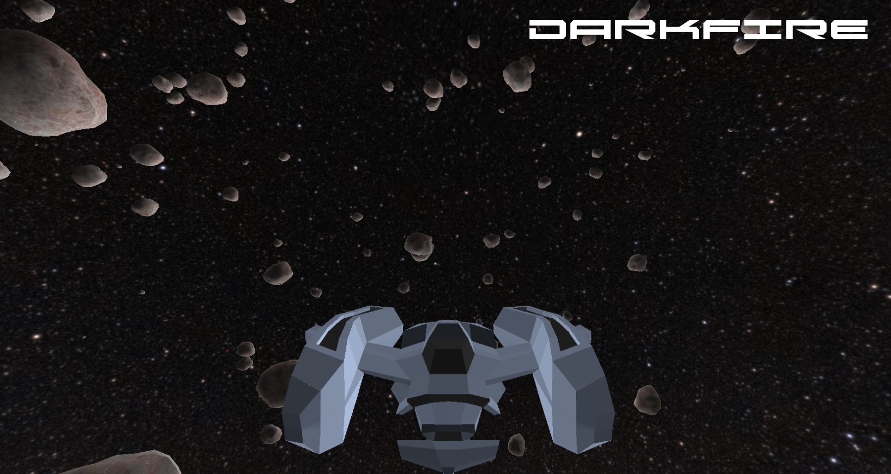

## DarkFire Game Engine :fire:

Welcome to the DarkFire Game Engine repository! This powerful engine is designed with an entity component system and utilizes DirectX 11 to bring you the best performance and graphics for game development. :video_game:

## About DarkFire :sparkles:
DarkFire is the brainchild of Omar Gamal, a dedicated Computer Science student at Helwan University. This project showcases Omar's passion for game development and his proficiency in modern game engine architecture. :mortar_board:

## Features :star2:
- Entity Component System (ECS) architecture for efficient game object management.
- DirectX 11 integration for stunning visual effects and smooth gameplay.
- A demo game "Space Shooter" to demonstrate the capabilities of the engine.
- Easy-to-use interfaces for quick game development.
- Comprehensive documentation to get you started.

## Getting Started :rocket:
To get started with DarkFire, clone this repository and check out the `docs` directory for instructions on setting up your development environment and starting your first project.

## Demo Game: Space Shooter :space_invader:
Included in this repository is a demo game that showcases what DarkFire is capable of. Dive into the "Space Shooter" and see the engine in action!

## How to Contribute :handshake:
Contributions are what make the open-source community such an amazing place to learn, inspire, and create. Any contributions you make are **greatly appreciated**.

1. Fork the Project
2. Create your Feature Branch (`git checkout -b feature/AmazingFeature`)
3. Commit your Changes (`git commit -m 'Add some AmazingFeature'`)
4. Push to the Branch (`git push origin feature/AmazingFeature`)
5. Open a Pull Request

## License :scroll:
Distributed under the MIT License. See [LICENSE](https://github.com/Omar0Gamal/DarkFire/blob/main/LICENSE) for more information.

## Contact :phone:
Omar Gamal - [omar.gamal.m@gmail.com]

Project Link: [LINK](https://github.com/Omar0Gamal/DarkFire)

Thank you for visiting the DarkFire Game Engine repository! :heart: Happy coding!
